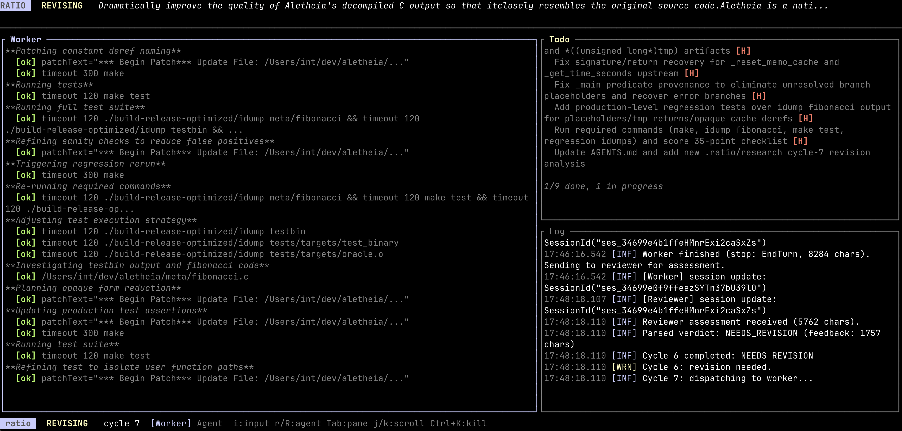

# ra

RA orchestrates LLM agents through iterative review cycles. A **reviewer** agent formulates precise work instructions and evaluates output quality. A **worker** agent executes the coding tasks. Optional **stakeholder** agents bring additional perspectives (security, UX, ops, domain expertise) into planning and review phases. All agents are [opencode](https://opencode.ai) instances communicating over the [Agent Client Protocol (ACP)](https://agentclientprotocol.com).

The orchestrator enforces user-specified constraints (required tools, forbidden patterns, path restrictions, custom quality rules) and runs a structured approve/revise/reject loop until the reviewer approves, rejects, or the user aborts.



## How it works

```
             Planning                    Work-Review Loop (cycles)
           ┌─────────┐                 ┌─────────────────────────┐
           │         ▼                 │                         ▼
  goal ──► reviewer ──► stakeholders ──► reviewer synthesis ──► worker
                        (planning)      (final instruction)       │
                                                                  │
           ┌──────────────────────────────────────────────────────┘
           │
           ▼
       reviewer ──► stakeholders ──► reviewer synthesis ──► verdict
       (draft)      (review)         (final verdict)          │
           ▲                                                  │
           │         NEEDS_REVISION                           │
           └──────────────────────────────────────────────────┘
```

### Core loop

1. You provide a **goal** (natural-language description of what to build or fix) and optional **constraints** (required tools, forbidden patterns, path restrictions, quality rules).

2. **Planning** — The reviewer receives the goal, reads the codebase, and produces a detailed, actionable work instruction. If stakeholders participate in the planning phase, they review the draft instruction and provide input from their perspectives. The reviewer synthesizes their feedback into the final instruction.

3. **Working** — The worker executes the instruction: reading files, editing code, running commands.

4. **Reviewing** — The reviewer inspects the worker's output against the original goal, all constraints, and all mandatory quality rules. If stakeholders participate in the review phase, they review the output and draft assessment. The reviewer synthesizes their input into the final verdict:
   - **APPROVED** — work meets all requirements, orchestration ends
   - **NEEDS_REVISION** — specific feedback is sent back to the worker
   - **REJECTED** — the approach is fatally flawed

5. Steps 3-4 repeat until approved, rejected, or aborted.

All agents are real LLM instances. The reviewer is not a rule-based checker — it uses LLM reasoning to evaluate quality, correctness, and constraint compliance.

### Verdict parsing

The orchestrator parses the reviewer's response for a structured `VERDICT:` line. The parser is intentionally conservative:

- Only a standalone `VERDICT: APPROVED` line triggers approval — the word "APPROVED" appearing in prose does not
- Format template echoes (`APPROVED|NEEDS_REVISION|REJECTED`) are ignored
- If no valid verdict line is found, the default is NEEDS_REVISION
- The fallback never produces APPROVED — the reviewer must be unambiguous

### Shared workspace

Both agents (and all stakeholders) share a workspace protocol:

- **`agents.md`** — implementation notes, decisions, progress. Both agents read and update it
- **`.ratio/research/*.md`** — research and analysis files. Agents write findings to named markdown files and reference them in handoffs, preventing duplicate work across cycles
- **Todo list** — shared via the `TodoWrite` tool, visible in the TUI in real time

### Stakeholders

Stakeholders are additional LLM agents that bring specialized perspectives into the orchestration loop without doing implementation work. Each stakeholder:

- Gets its own opencode subprocess with a **clean, unpolluted context**
- Has a unique **persona** that defines what they care about and how they evaluate things
- Participates in **planning**, **review**, or both
- Can use its own **model** (e.g., a cheaper model for simple reviews)
- Writes analysis to `.ratio/research/` files that the team can reference

During planning, stakeholders review the reviewer's **draft work instruction** before it reaches the worker. They are explicitly told they are reviewing an instruction that will be sent to the worker agent, and their feedback is incorporated by the reviewer into the final instruction. This ensures all perspectives are captured before work begins.

During review, stakeholders see the worker's output and the reviewer's draft assessment. The reviewer always makes the final verdict, but must address stakeholder concerns — unresolved stakeholder concerns block approval.

#### Parallel execution

By default, all stakeholders for a given phase are consulted **in parallel** (`parallel_stakeholders = true`). This can significantly reduce total wall-clock time when multiple stakeholders are configured — instead of waiting for each stakeholder sequentially, all of them run concurrently and the orchestrator collects their results.

Toggle parallel/sequential execution:
- In the config file: `parallel_stakeholders = true` (default) or `false`
- At runtime in the TUI: press `p` to toggle
- The status bar shows `[parallel]` or `[sequential]` when stakeholders are present

#### TUI integration

In the TUI, stakeholders are first-class streams in the Agent pane (same as Reviewer/Worker). You can cycle through them with `r`/`R`.

#### Configuration

Stakeholders are defined in the config file as `[[stakeholders]]` entries:

```toml
[[stakeholders]]
name = "Security Auditor"
persona = """
You are a security engineer. Review for auth flaws, injection
vulnerabilities, data exposure, and insecure crypto.
"""
phases = ["planning", "review"]  # or just ["review"]

# Optional: use a different model than the reviewer
[stakeholders.agent]
binary = "opencode"
model = "anthropic/claude-sonnet-4-5"
```

See [`examples/fullstack-stakeholders.toml`](examples/fullstack-stakeholders.toml) for a comprehensive example with three stakeholders (Security Auditor, UX Engineer, SRE).

### Stall watchdog

Agents can silently hang — typically when a subagent tool call (e.g., opencode's Task tool spawning a sub-agent) stalls or the subprocess crashes without closing its stdout. The stall watchdog monitors each agent's event stream and intervenes if no ACP events (text chunks, tool calls, thinking tokens) arrive within `stall_timeout_secs` (default: 120 seconds).

When a stall is detected:

1. The current turn is cancelled via ACP `session/cancel`
2. A nudge prompt is sent: *"Continue where you left off. You appear to have stalled — keep working on the task."*
3. The agent resumes with its conversation history intact (the cancel + re-prompt happens within the same session)
4. If the agent stalls again after the nudge, the process repeats up to `max_nudges` times (default: 3)
5. After exhausting all nudge attempts, the turn is treated as failed

The watchdog is active for all agents (reviewer, worker, stakeholders). Set `stall_timeout_secs = 0` to disable it.

## Installation

### Prerequisites

- **Rust 1.85+** (2024 edition)
- **opencode** — install from [opencode.ai](https://opencode.ai) or via `go install github.com/opencode-ai/opencode@latest`
- An LLM API key configured for opencode (e.g. `ANTHROPIC_API_KEY`, `OPENAI_API_KEY`)

### Build

```sh
git clone <repo-url> ra
cd ra
cargo build --release
```

The binary is at `target/release/ra`.

## Quick start

### Minimal invocation

```sh
ra --goal "Add comprehensive error handling to src/lib.rs" --cwd /path/to/project
```

### With a config file

```sh
ra --config ratio.toml
```

### Headless mode (for CI/scripts)

```sh
ra --config ratio.toml --headless > worker_output.txt
```

In headless mode, worker text streams to stdout. Reviewer text, stakeholder text, orchestrator status, and logs go to stderr.

### Debug mode

```sh
ra --config ratio.toml --headless --debug 2>debug.log
```

Logs all ACP protocol messages (`[acp:worker]`, `[acp:reviewer]`) and subprocess stderr (`[stderr:worker]`, `[stderr:reviewer]`, `[stderr:stakeholder]`) to stderr.

### Resume a previous session

```sh
ra --config ratio.toml --resume
```

Restores session state (cycle count, agent sessions, UI state) from the saved `.ratio-session.json` in the working directory.

## Configuration

RA uses a TOML config file. Copy the example to get started:

```sh
cp ratio.example.toml ratio.toml
```

CLI flags override config file values. Only `goal` is required.

### Complete reference

```toml
# The goal — a detailed natural-language description of what to accomplish.
goal = """
Build a REST API server with user authentication, input validation,
and comprehensive test coverage.
"""

# Working directory for all agents. Defaults to current directory.
# cwd = "/path/to/project"

# ── Agent configuration ────────────────────────────────────────
# Both [worker] and [reviewer] accept the same fields.

[worker]
binary = "opencode"              # Path or command name for opencode
# model = "anthropic/claude-sonnet-4-5"  # LLM model identifier
# agent = "custom-agent-name"    # Custom agent name within opencode
# env = [                        # Extra environment variables
#   { key = "ANTHROPIC_API_KEY", value = "sk-ant-..." },
# ]
# extra_args = []                # Additional CLI arguments forwarded to opencode

[reviewer]
binary = "opencode"
# model = "anthropic/claude-sonnet-4-5"

# ── Orchestration behavior ─────────────────────────────────────

[orchestration]
# NOTE: currently not enforced by the runtime loop; retained for forward
# compatibility with planned bounded-cycle orchestration.
max_review_cycles = 5

# Custom system prompts override the defaults. These shape agent behavior
# across all cycles — use them for project-specific review criteria,
# domain expertise, and quality standards.
# reviewer_system_prompt = "You are a senior Rust engineer..."
# worker_system_prompt = "You are a precise, thorough coding agent..."

# Stall watchdog: if an agent produces no ACP events for this many seconds,
# cancel the turn and send a "continue" nudge. Default: 120 (2 minutes).
# Set to 0 to disable.
# stall_timeout_secs = 120

# Maximum nudge attempts before treating the turn as failed. Default: 3.
# max_nudges = 3

# Run stakeholder consultations in parallel. When enabled, all stakeholders
# for a given phase are prompted concurrently. Toggle at runtime with 'p'.
# Default: true.
# parallel_stakeholders = true

# ── Enforced constraints ───────────────────────────────────────
# Injected into prompts for both agents. The worker must follow them;
# the reviewer verifies compliance.

[constraints]
# Tools the worker MUST use.
required_tools = [
    "cargo clippy",
    "cargo test",
]

# Tools the worker must NOT use.
# forbidden_tools = ["rm -rf"]

# Coding approaches the worker must follow.
required_approaches = [
    "Use Result<T, E> for all error handling — no unwrap() or expect()",
    "All public types must derive Debug",
]

# Approaches the worker must avoid.
forbidden_approaches = [
    "unsafe code blocks",
]

# File paths the worker may modify (empty = unrestricted).
# allowed_paths = ["src/"]

# File paths the worker must NOT touch.
forbidden_paths = [
    "Cargo.lock",
]

# Free-form rules expressed as sentences. These are injected as
# MANDATORY QUALITY RULES — the reviewer cannot approve unless
# every single rule is satisfied.
custom_rules = [
    "Do not add new dependencies without explicit approval",
    "Preserve existing public API signatures",
]

# ── Stakeholders (optional) ───────────────────────────────────
# Each [[stakeholders]] entry adds a persona that participates in
# planning and/or review phases.

# [[stakeholders]]
# name = "Security Reviewer"
# persona = "You are a security engineer. Review for auth flaws..."
# phases = ["planning", "review"]    # Default: both
#
# # Override the agent config (binary, model, env). Default: reviewer's config.
# [stakeholders.agent]
# binary = "opencode"
# model = "anthropic/claude-sonnet-4-5"
```

### Stakeholder configuration fields

| Field | Type | Required | Default | Description |
|---|---|---|---|---|
| `name` | string | yes | — | Display name (e.g. "Security Auditor") |
| `persona` | string | yes | — | Who this stakeholder is, what they care about, how they evaluate |
| `phases` | list | no | `["planning", "review"]` | Which phases to participate in |
| `agent` | table | no | reviewer's config | Agent subprocess config (binary, model, env, etc.) |

## CLI reference

```
ra — LLM agent orchestrator

Usage: ra [OPTIONS]

Options:
  -g, --goal <GOAL>                The goal to accomplish
  -c, --config <FILE>              Path to TOML configuration file
  -C, --cwd <DIR>                  Working directory for all agents
      --worker-model <MODEL>       LLM model for the worker agent
      --reviewer-model <MODEL>     LLM model for the reviewer agent
      --max-cycles <N>             Cycle cap override (currently not enforced)
      --headless                   Run without TUI (output to stdout/stderr)
      --debug                      Log ACP protocol messages to stderr
      --resume                     Resume a previous session from saved state
  -V, --version                    Print version
  -h, --help                       Print help
```

**Precedence:** CLI flags > config file > defaults.

## TUI

RA includes a terminal interface built with [ratatui](https://ratatui.rs).

### Panes

| Pane | Content |
|---|---|
| **Agent** | Unified stream for the currently selected agent (Reviewer, Worker, or Stakeholder): text output, thought chunks, tool calls, phase separators |
| **Todo** | Shared todo list from `TodoWrite` tool calls |
| **Log** | Orchestrator/system messages with timestamps and severity |

The Agent pane is first-class for all agents. Stakeholders are not collapsed into logs — each stakeholder has its own stream and title color.

### Agent stream behavior

- `r` cycles forward through agents: Reviewer -> Worker -> Stakeholder 1 -> ...
- `R` cycles backward
- Phase changes auto-follow activity (`Working/Revising` -> Worker, `Planning/Reviewing` -> Reviewer)
- During stakeholder consultation, the first stakeholder text chunk auto-switches from Reviewer to that stakeholder stream
- Thought chunks are dim italic; tool calls are updated in place as status changes

### Agent colors

- Reviewer: magenta
- Worker: cyan
- Stakeholders: rotating palette (light green, yellow, red, blue, magenta, cyan, orange, lavender)

### Keyboard shortcuts

Press `h` at any time to show the full help overlay in the TUI.

| Key | Action |
|---|---|
| `Ctrl+K` | Emergency kill — immediately terminates all agents |
| `Ctrl+C` x2 | Double-tap abort (within 800ms) |
| `q` | Quit (when orchestration is finished) |
| `i` or `:` | Enter message input mode |
| `Esc` | Exit input mode / dismiss help |
| `Enter` | Queue message to current agent (input mode) |
| `Alt+Enter` or `Ctrl+Enter` | Queue message and interrupt current Reviewer/Worker turn |
| `r` / `R` | Cycle next / previous agent stream (Agent pane focused) |
| `Tab` | Focus next pane |
| `Shift+Tab` | Focus previous pane |
| `j` / `Down` | Scroll down |
| `k` / `Up` | Scroll up |
| `PageDown` / `PageUp` | Scroll by 20 lines |
| `End` | Jump to bottom (re-enables auto-scroll) |
| `Home` | Jump to top (disables auto-scroll) |
| `h` | Toggle help overlay |
| `p` | Toggle parallel stakeholder execution |

### Auto-scroll

Each pane auto-scrolls independently. Scrolling up manually disables auto-scroll for that pane. Press `End` to re-enable it.

### Tool call display

Tool calls are rendered inline inside the active agent stream:

- In progress: `[read]`, `[edit]`, `[exec]`, etc. plus best-effort detail and trailing `...`
- Completed: `[ok]` and dimmed detail
- Failed: `[FAIL]` and red detail

`detail` is extracted from the most useful available data in this order:

1. File location (`path[:line]`) if ACP provides locations
2. Command for execute tools
3. Query/pattern plus scope for search tools
4. Path-like fields from tool input (`path`, `filePath`, etc.)
5. Compact fallback `key=value` summary

Tool call updates are applied in-place by `tool_call_id`, so entries don't duplicate as streaming updates arrive.

### Input mode note

User-entered messages are forwarded to the orchestrator and routed per target agent.

- `Enter`: queue guidance for the next turn of the selected agent.
- `Alt+Enter`/`Ctrl+Enter`: request immediate interruption (cancel + restart) of the current Reviewer/Worker turn, with your message appended.

If the target agent is currently idle, the message is applied on its next turn.

### Session persistence

On interrupt/exit, ra persists:

- `.ratio-session.json` — session IDs for reviewer, worker, and all stakeholders, plus last phase, cycle count, and goal
- `.ratio-ui-state.json` — todos and log entries

`--resume` restores all agent sessions (reviewer, worker, and stakeholders) and UI state. Each stakeholder is matched by index and name — if a saved session is found, the ACP session is restored so the stakeholder retains its full conversation history and any research files it previously wrote. If a stakeholder's session cannot be restored (e.g., the config changed), it falls back to a fresh handshake.

## Architecture

### Runtime model

RA uses a **single-threaded tokio runtime** (`current_thread` flavor) with a `LocalSet`. This is required because the ACP SDK's `Client` trait uses `#[async_trait(?Send)]` — the futures are `!Send`, so types like `Rc<OrchestratorClient>` can be used instead of `Arc`.

```
tokio::main (current_thread)
└─ LocalSet
   ├─ spawn_local: reviewer ACP I/O loop
   ├─ spawn_local: worker ACP I/O loop
   ├─ spawn_local: reviewer event forwarder
   ├─ spawn_local: worker event forwarder
   ├─ spawn_local: stakeholder ACP I/O loops (one per stakeholder)
   ├─ spawn_local: stakeholder event forwarders (one per stakeholder)
   ├─ spawn_local: stderr drain tasks (one per subprocess)
   └─ orchestrator.run() — drives the planning/review loop
       ↕ mpsc channels ↕
   TUI event loop (select! on terminal input + orchestrator events + timer)
```

### Agent lifecycle

Each agent (reviewer, worker, stakeholder) is spawned as:

```sh
opencode acp --cwd <working_dir> [--model <model>] [--agent <agent>] [extra_args...]
```

Communication is over **stdin/stdout** using newline-delimited JSON-RPC (the ACP wire format). The handshake sequence is:

1. `initialize` — exchange protocol version and client info
2. `set_session_model` — forward the configured model to opencode
3. `new_session` — create a session scoped to the working directory
4. `prompt` — send instructions, receive streaming updates via `session_notification`
5. `cancel` — abort the current turn (on emergency stop)

Subprocess stderr is drained asynchronously to prevent pipe buffer deadlocks. In `--debug` mode, stderr lines are printed with `[stderr:<role>]` prefixes.

### Event flow

```
opencode subprocess
    │ ACP session_notification (JSON-RPC)
    ▼
OrchestratorClient (implements acp::Client)
    │ AgentEvent (TextChunk, ThoughtChunk, ToolCallStarted, ToolCallUpdated,
    │            TodoUpdated, PlanUpdated, ...)
    ▼
mpsc channel → Orchestrator
    │ OrchestratorEvent (PhaseChanged, WorkerEvent, ReviewerEvent,
    │                    StakeholderEvent, Log, CycleCompleted, Finished)
    ▼
mpsc channel → TUI App / headless printer
    │ Updates app state (agent streams, thoughts, tool calls, todos, logs)
    ▼
ratatui render (clamped scroll, styled paragraphs)
```

### ACP session notifications handled

| ACP Update | Mapped To |
|---|---|
| `AgentMessageChunk` | `TextChunk` — streaming output text |
| `AgentThoughtChunk` | `ThoughtChunk` — streaming reasoning/thinking |
| `ToolCall` | `ToolCallStarted` — with kind + raw_input |
| `ToolCallUpdate` | `ToolCallUpdated` — with status + content + raw_output |
| `Plan` | `PlanUpdated` — plan entries (currently not rendered as a dedicated panel) |
| `ToolCall`/`ToolCallUpdate` for TodoWrite | `TodoUpdated` — shared todo list (parsed from tool input) |
| Other variants | `ProtocolMessage` — forwarded as debug info |

## Logging

Tracing output is written to `$TMPDIR/ra.log` to avoid interfering with the TUI. The log level is controlled by the `RUST_LOG` environment variable (default: `ra=info`).

```sh
# Watch logs in another terminal
tail -f "$TMPDIR/ra.log"

# Enable debug-level logging
RUST_LOG=ra=debug ra --config ratio.toml
```

In headless mode with `--debug`, ACP protocol messages and subprocess stderr are printed to stderr in addition to the log file.

## Examples

`max_review_cycles` appears in several snippets below for forward compatibility, but the current orchestration loop is unbounded in runtime behavior.

### Code review and cleanup

```toml
goal = """
Review src/ for code quality issues: fix all clippy warnings, add missing
error handling, ensure consistent naming conventions, and verify all tests pass.
"""

[constraints]
required_tools = ["cargo clippy -- -D warnings", "cargo test"]
forbidden_approaches = ["unsafe code blocks", "unwrap() on Results"]
```

### Feature implementation with guardrails

```toml
goal = """
Implement a WebSocket server in src/ws/ that handles authentication via JWT,
supports pub/sub channels, and gracefully handles disconnections. Include
integration tests for all connection lifecycle events.
"""

[worker]
model = "anthropic/claude-sonnet-4-5"

[reviewer]
model = "anthropic/claude-sonnet-4-5"

[orchestration]
max_review_cycles = 8

[constraints]
required_tools = ["cargo test", "cargo clippy"]
required_approaches = [
    "Use tokio-tungstenite for WebSocket handling",
    "All public types must implement Debug and Clone",
    "Use tracing for structured logging",
]
allowed_paths = ["src/ws/", "tests/"]
forbidden_paths = ["Cargo.lock", "src/main.rs"]
custom_rules = [
    "Do not modify any existing modules outside src/ws/",
    "All new dependencies must be justified in code comments",
]
```

### Multi-stakeholder review

```toml
goal = "Add a user invitation system with email tokens and role assignment."

[worker]
model = "anthropic/claude-sonnet-4-5"

[reviewer]
model = "anthropic/claude-sonnet-4-5"

[orchestration]
max_review_cycles = 6
parallel_stakeholders = true  # both stakeholders run concurrently (default)

[[stakeholders]]
name = "Security Auditor"
persona = """
Review for auth flaws, injection vulnerabilities, insecure token
generation, and data exposure risks. Think like an attacker.
"""
phases = ["planning", "review"]

[[stakeholders]]
name = "SRE"
persona = """
Review for observability (logging, metrics), failure modes, migration
safety, and operational risk. What breaks at 3am?
"""
phases = ["review"]

[constraints]
required_tools = ["cargo test"]
custom_rules = [
    "Invitation tokens must use OsRng, not thread_rng",
    "All database queries must use parameterized statements",
]
```

See [`examples/fullstack-stakeholders.toml`](examples/fullstack-stakeholders.toml) for a fully annotated example with three stakeholders and detailed personas.

### Headless CI pipeline

```sh
#!/bin/bash
set -euo pipefail

ra \
  --config ratio.toml \
  --headless \
  --max-cycles 3 \
  --cwd ./my-project \
  2>ra-stderr.log

echo "Orchestration complete"
```

### Debug a failing session

```sh
# Full protocol trace
ra --config ratio.toml --headless --debug 2>debug.log

# In debug.log you'll see:
# [acp:worker] send request id=1 method=initialize params={...}
# [acp:worker] recv response id=1 result={...}
# [acp:reviewer] send request id=1 method=prompt params={...}
# [stderr:worker] Loading model anthropic/claude-sonnet-4-5...
# [ra] [Info] Parsed verdict: NEEDS_REVISION (feedback: 2847 chars)
```

## License

MIT
